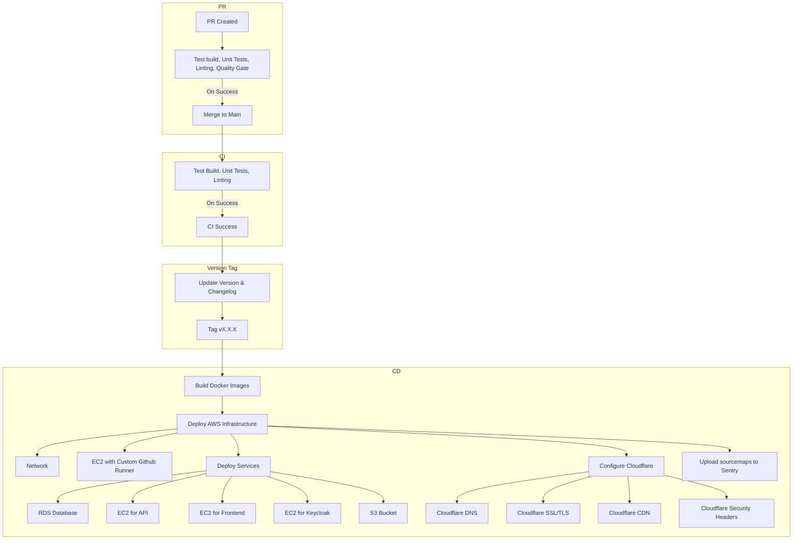

# Demo shop public

A full-stack e-commerce application built for educational purposes using modern web technologies.

A more refined implementation of the API with ASP.NET Core can be found in this repository:

```
http://github.com/christian-wandling/demo-shop-dotnet-api
```

## Overview

This project implements an e-commerce application with:

- User authentication and authorization
- Product catalog with categories
- Shopping cart functionality
- Order processing
- PDF invoice generation

## Tech Stack

### Frontend

- **Angular** - Progressive web framework
- **TypeScript** - Type-safe JavaScript
- **NgRx** - State Management
- **HTML2Canvas/jsPDF** - Pdf generation
- **Tailwind CSS** - Styling

### Backend

- **NestJS** - Progressive Node.js framework
- **NestJS Throttler** - Rate limiting
- **OpenAPI/Swagger** - API documentation
- **Prisma** - Modern ORM for database access
- **PostgreSQL** - Relational database

### Monitoring

- **Sentry** - Monitoring

### Auth

- **Keycloak** - Secure Authentication

### Testing

- **Jest** - Unit testing

### Dev workflow

- **Commitlint/Commitizen** - Standardize commit messages
- **Husky** - Pre-commit hooks
- **ESLint/Lint-staged** - automatic linting
- **Prettier** - automatic code formating

### DevOps & Infrastructure

- **Nx** - Mono-repo build system
- **Docker** - Containerization
- **Terraform** - Infrastructure as Code
- **Github CI/CD** - Continuous Integration/Continuous Deployment
- **AWS** - Cloud hosting platform

## Setup

### Prerequisites

- [Node.js 20](https://nodejs.org/en) or later
- [npm](https://www.npmjs.com/) or [yarn](https://yarnpkg.com/)
- [Docker](https://www.docker.com/)

### Installation

1. Clone the repository

```
git clone https://github.com/christian-wandling/demo-shop-public.git
```

2. Install dependencies

```
npm install
```

3. Set up environment variables

```
# Edit .env file with your configuration
cp .env.example .env
```

- You can choose to omit configuring sentry or see the section on setting up [sentry](#sentry-setup)
- `KEYCLOAK_REALM_PUBLIC_KEY` is needed by the api to validate tokens. It is dynamically created on keycloak server creation.
  - To retrieve it, follow the installation steps to build & run the docker containers
  - Next access the keycloak server.
  ```
  http://localhost:8080/admin/master/console/#/demo_shop/realm-settings/keys
  ```
  - Click on the Public Key of RS256 and use its value in your .env file

4. Create shared docker network (or remove network from compose file)

```
docker network create shared
```

5. Generate prisma client

```
npm run prisma:generate
```

6. Push the prisma schema to database

```
npm run prisma:migrate:dev
```

7. Build & Run the docker containers

```
# this will build and run docker containers for frontend, api, postgres, keycloak, pgadmin
npm start
```

8. Access the application

```
Frontend: http://localhost:4200
API: http://localhost:3000
Swagger Documentation: http://localhost:3000/api
Keycloak: http://localhost:8080
PgAdmin: http://localhost:80
```

### Usage

1. Open the web app

```
http://localhost:4200
```

### Sentry Setup

1. Go to [sentry.io](https://sentry.io/welcome/) to create an account and follow the steps to setup projects for frontend and api

2. Add configuration values to your .env file

3. Run the sentry wizard to complete the setup

```
npx @sentry/wizard@latest -i sourcemaps --saas
```

### Dotnet APi Integration

An equivalent API created with ASP.Net Core is available in the following repository:

```
http://github.com/christian-wandling/demo-shop-dotnet-api
```

## User management

### User registration via web app

1. Open the web app

```
http://localhost:4200
```

2. Click `Register` and create the user

### User creation via Keycloak admin console

1. Access the Keycloak server to add a user

```
http://localhost:8080/admin/master/console/#/demo_shop/users/add-user
```

2. To login use `KEYCLOAK_ADMIN` and `KEYCLOAK_ADMIN_PASSWORD` defined in your [.env](.env) file.

3. Fill `Email`, `First Name` and `Last name`

4. Navigate to the `Credentials` tab and use `Set Password` to create as password

5. Fill `Password` and `Password Confirmation` and deselect `Temporary`

## Database

### Seeding

```
npm run prisma:seed
```

The [seed](prisma/seed.ts) script will attempt to add entities to the database:

- products, if the product table is empty
- users, if any user in the keycloak has not been added to the user table
- orders, for any user that has no orders attached

2. Browse products

3. Sign in to access the shopping and order features

### Access with Prisma Studio

Open prisma studio via console

```
prisma studio
```

### Access with PgAdmin

1. Open PgAdmin in your browser

```
http://localhost:80
```

2. Enter the password you set for `PGADMIN_DEFAULT_PASSWORD` in your .env file

3. Register new server. You can give it any name.

4. In the connection tab of the server use `db` for host and for username and password use the values of `POSTGRES_USER` and `POSTGRES_PASSWORD` in your .env file

## Testing

To run all tests in the project use

```
npm run test
```

To test an app or lib use

```
nx test <name>
```

## Deployment

This repository includes a comprehensive CI/CD pipeline for deploying a fullstack application to AWS with Cloudflare for DNS management and CDN services.

### Continuous Integration

- PR Workflow: When a PR is created to main, a test build is created with unit tests, linting, SonarQube, and GitHub code checks
- Main Branch CI: On merge to main, test builds and checks run again
- Versioning: Successful main branch builds trigger the version workflow, which:
  - Updates the version number using semantic versioning determined from commit messages
  - Generates a changelog from commit messages
  - Creates a new tag

### Continuous Deployment

- Trigger: New tag creation automatically triggers the CD workflow
- Build Phase: Docker images are built for both frontend and API components
- Infrastructure Deployment:
  - Network infrastructure is provisioned using Terraform
  - EC2 instance with custom GitHub runner is deployed
- Service Deployment via custom GitHub runner:
  - RDS database
  - EC2 instance for API
  - EC2 instance for frontend
  - EC2 instance for Keycloak
  - S3 bucket for assets
- Monitoring: Sourcemaps are uploaded to Sentry for error tracking

- External Services
  - Cloudflare: Manages DNS, SSL/TLS, and CDN services

### Prerequisites

- Github Setup

  - GitHub repository access with proper permissions
  - GitHub Actions secrets configured for AWS, Cloudflare, and Sentry credentials
  - Branch protection rules for main branch

- AWS Requirements:

  - AWS account with programmatic access
  - IAM user with appropriate permissions for EC2, S3, RDS, VPC, etc.
  - AWS credentials stored securely in GitHub Secrets
  - Postgres and Keycloak credentials stored securely in AWS

- Cloudflare Requirements:

  - Cloudflare account
  - Domain added to Cloudflare
  - API token with appropriate permissions
  - Cloudflare API token stored in GitHub Secrets

- Sentry Requirements:

  - Sentry account and project
  - Auth token for sourcemap uploads
  - Sentry credentials stored in GitHub Secrets

- SonarQube Requirements:
  - SonarQube server or SonarCloud account
  - Project setup in SonarQube/SonarCloud
  - SonarQube credentials stored in GitHub Secrets
  - sonar-project.properties file in repository root

### Diagram



## 📜 License

This project is licensed under the MIT License - see the [LICENSE](LICENSE) file for details.
